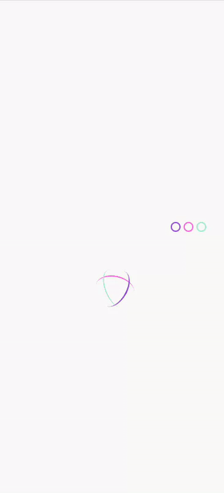

# OhMyFood - projet Openclassrooms
Troisième projet du parcours ***développeur web*** chez **OpenClassrooms**, dont l'objectif est de réaliser un site web pour la startup Ohmyfood! et le dynamiser à l'aide d'animations CSS. Orienté à 100% vers les mobiles, il répertorie les menus de restaurants gastronomiques.

## Éléments fournis par l'entreprise virtuelle.
- Un logo sous deux formats (svg et png).
- Les images de restaurants en plein format.
- Cinq maquettes Mobile (une page d'accueil et quatre menus).
- Deux vidéos présentant les animations.
- Un fichier txt avec l'ensemble des textes nécessaires pour les menus.
- Une [brief créatif](https://s3-eu-west-1.amazonaws.com/course.oc-static.com/projects/DW_P3/Brief%20cre%CC%81atif%20-%20Ohmyfood!.pdf) sous format pdf.

## Cahier des charges

### Charte graphique 
- Les icônes proviennent de la bibliothèque [Font Awesome](https://fontawesome.com/)
- Les polices utilisées sont [Shrikhand](https://fonts.google.com/specimen/Shrikhand) (*logo et titres*) et [Roboto](https://fonts.google.com/specimen/Roboto)
- Les couleurs sont :
    - Primaire : *#9356DC*
    - Secondaire : *#FF79DA*
    - Tertiaire : *#99E2D0*

### Fonctionnalités et contenu
- Page d'accueil
    - Affichage de la localisation des restaurants.
    - Courte présentation de l'entreprise.
    - Section contenant les quatre menus sous forme de carte, redirigeant vers chaque menu.
- Footer
    - Identique sur toutes les pages.
    - L'onglet *Contact* redirige vers une adresse mail.
- Header
    - Présent sur toutes les pages.
    - Ne contient que le logo sur la page d'accueil.
    - Contient un bouton de retour en plus du logo sur les autres pages.

### Animations et effets graphiques
Réalisées uniquement à partir de CSS (transition et animation). Javascript n'est pas autorisé. 
Les maquettes définissent les effets souhaités.
- Les boutons principaux s'éclaircissent au survol. Leur ombre portée est également plus visible.
- Les boutons "J'aime" (en forme de cœur) se remplissent progressivement.
- Un *loading spinner* est souhaité au chargement de la page d'accueil.
- Au chargement des menus, l'apparition des plats doit s'effectuer progressivement (par plat et/ou par groupe).
- Au survol d'un plat, une coche, placée à sa droite, apparait de droite à gauche. Le nom du plat est rogné s'il est trop long.

### Contraintes techniques
- Adopter une approche Mobile-first
- Adapter le site aux tablettes et desktops, en plus de la version Mobile.
- Séparer le code HTML et CSS et organiser le dossier de rendu.
- Utilisation du préprocesseur CSS Sass recommandée.
- Pas d'utilisation de framework (ex: Bootstrap) ou javascript.
- Utiliser les balises sémantiques et n'avoir aucune erreur ni alerte au validateur W3C [HTML](https://validator.w3.org/nu/?doc=https%3A%2F%2Fmickgalmiche.github.io%2FMickaelGalmiche_3_05072021%2F) et [CSS.](https://jigsaw.w3.org/css-validator/validator?uri=https%3A%2F%2Fmickgalmiche.github.io%2FMickaelGalmiche_3_05072021%2F&profile=css3svg&usermedium=all&warning=1&vextwarning=&lang=fr)
- Site compatible avec les dernières versions de Chrome et Firefox.
- Versionner le code avec Git. Le déployer dans un [repository distant](https://github.com/MickGalmiche/MickaelGalmiche_3_05072021) et sur les [pages de Github ou Gitlab.](https://mickgalmiche.github.io/MickaelGalmiche_3_05072021/)

